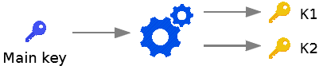
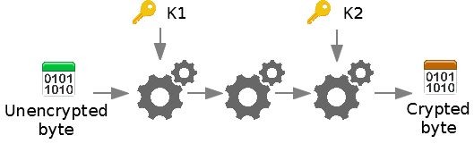

# s-des
An implementation of the educational cryptographic algorithm S-DES.

## To whom is it intended?
To everyone who wants to understand the working of modern cryptographic algorithms.

## How does it work?
S-DES will run through your message and distort each fragment of eight bits using the key you provided to it.

But first, it will need to **generate two sub-keys** (K1 and K2) because it cannot use directly your main key.

Then, with K1 and K2, it will be able to read your message and **pass the pieces through some simple functions** named IP, FK, SW and others.

After this, your message will be **successfully encrypted**.

For a complete explaination of the proccess, see [the documentation](docs/s-des.md).
