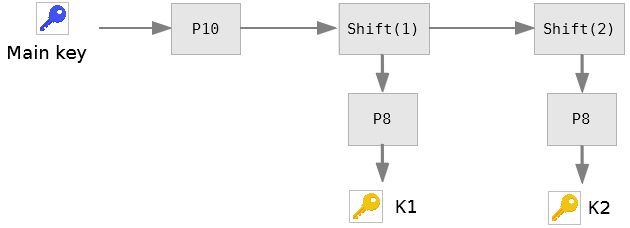
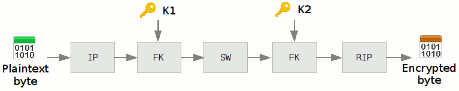

# What is SDES?
In our modern computerized world, protection of our data has become essential.  
Encryption is the most common way to achieve this. Numerous algorithms were 
invented to encrypt arbitrary data; the most used today is probably the **AES** 
(Advanced Encrypting Standard). It is powerful but also very hard to understand. 
It is the successor of the **DES** (Data Encryption Standard) less secure but 
also very complicated.  
Unfortunately, they are hard to understand for someone who is willing to learn 
crytpography. That is why an algorithm named **SDES** (Simplified DES) was 
invented. It takes all the base principles of the DES (and by extension AES) 
but **everything in it is simplified**.  

# How does it work?
As in every encrypting algorithms, SDES slices the message in chunks, and alter 
each of these given the key.  
The key is a small piece of information that you keep secret to encrypt and 
decrypt the message.  
In SDES, the key if of the size of 10 bits, for example `1001110100`.

## First step, generating the subkeys
Actually, SDES cannot use directly the key. It needs to compute two 8-bits 
subkeys which will be used in the process.

The actions named P10, Shift and P8 are some very simple functions:

**P10** performs a permutation (it changes the order of the bits) in this way:  

**Shift** performs a rotation of the bits on each half of the key:  
  
Its parameter correspond of the number of times the rotation is performed.

**P8** does an other permutation and keeps only 8 of the 10 orignal bits:  

At this point, we have a couple of keys, K1 and K2 that will be used on each
byte of the message in the next step.

## Second step, encrypting the message
Now we can actually alter the data. To achieve that, we will run through the 
input byte by byte. Each of these will pass through some simple functions.

**IP** performs a permutation:  

**RIP** is also a permutation, in such a way that when we perform successively
IP and RIP, we get the original byte:  

**SW** just simply swaps the two halves of the byte:  

**FK** meanwhile is an assemblage of functions.  
Given L and R the two halves of the byte.  
Given Kx the subkey, K1 or K2.  
Given ⊕ the Exclusive Or operator.  

FK is then defined as follows:  
`FK(L, R) = (L ⊕ f(R, Kx), R)`

**f** is a sub-function of FK and is a composition of simple functions:  
`f(R, Kx) = P4(sboxTransform(E/P(R) ⊕ Kx))`

Don't worry, these are the last ones.

**P4** is an other permutation:  

**E/P** is a permutation that expands the given array:  

**sboxTransform** is a function that uses the principle of the naval battle 
game.  
We define two tables called S-Boxes whose cells each contain two bits.
They are defined as follows:  

Their principle is simple, we take an input byte, for example `1010 0110`, and 
according to what it contains, it will select a cell for each table, giving the 
output value.
The first 4 bits on the left will be used for the array S0, and the 4 bits on
the right to table S1. Like this:  

**⊕** (**XOR**) is is a function that performs a logical operation of 
*exclusive or* between two sequences of bits:  

## Final step, decrypting the message

Decryption is very simple. We follow exactly the same processus as for
encryption, inverting K1 and K2.

